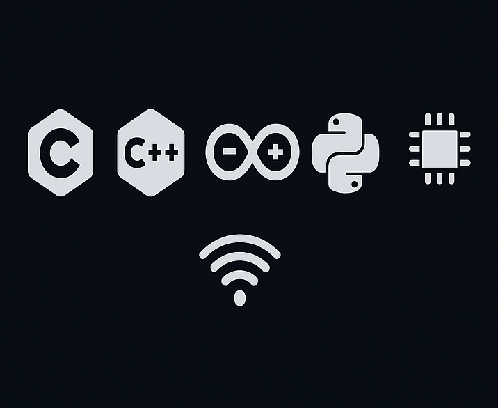

# 👋 Hi, I’m Kadyrzhan

I’m an **Embedded Systems Engineer** passionate about building efficient, intelligent systems that bridge hardware and software. My work spans **IoT**, **Edge AI**, **real-time systems**, and **low-power embedded design**. I'm currently pursuing my MSc in Embedded Systems and working on intelligent low-power designs for wireless and edge computing. I thrive at the intersection of hardware efficiency and AI-driven intelligence

---

## 💼 What I Do

🔧 Embedded systems development with C/C++, RTOS, and microcontrollers  
🌐 IoT sensor design + cloud integration  
📉 Real-time data acquisition and analysis  
🤖 Machine learning on edge devices (TinyML, PyTorch, TFLite)  
📡 Wireless protocols, CAN bus, LoRa, and MQTT  
🧠 Deep learning for signal processing and classification

---

## 📁 Featured Projects

- 🥦 [**Fruits & Vegetables Classification**](https://github.com/Kalifornia-ai/FruitsAndVegetablesClassification)  
  CNN-based image classifier using PyTorch and edge-deployable techniques

- 🔋 [**Low-Power IoT Environmental Monitor**](https://github.com/Kalifornia-ai/Low-Power-IoT-Environmental-Monitor)  
  Power-optimized sensor node using TMP117 & SPS30 with deep sleep

- ⏱️ [**CAN Delay Study (TrueTime)**](https://github.com/Kalifornia-ai/CAN-Delay-Study)  
  Simulink model with Poisson CAN traffic and regenerative simulation

- 📡 [**Satcom Interference Mitigation**](https://github.com/Kalifornia-ai/Satcom-interference-mitigation)  
  Deep learning models for RF signal denoising and separation

- 🏁 [**AsyncRaceAPI**](https://github.com/Kalifornia-ai/AsyncRaceAPI)  
  TypeScript + React + Redux web app simulating animated car races with REST & async control

---

**Languages:** C, C++, Python, Embedded C  
**Frameworks:** FreeRTOS, STM32 HAL, Arduino, PlatformIO  
**ML Tools:** PyTorch, TensorFlow Lite, Edge Impulse  
**Tools:** Git, KiCad, Simulink, TrueTime, VS Code 

---

## 📚 Currently Learning

- Embedded Linux and Yocto  
- STM32 bare-metal development  
- Edge AI benchmarking and model compression  
- CI/CD for firmware

---

## 🏅 Certifications
- TinyML by HarvardX (edX)
- Embedded Systems by Coursera / UC Irvine
- Introduction to Yocto (bootlin)

---

## 📬 Let’s Connect

- 📫 Email: [kadyrzhan.tortayev@gmail.com](mailto:kadyrzhan.tortayev@gmail.com)  
- 🔗 LinkedIn: [linkedin.com/in/kadyrzhan](https://linkedin.com/in/kadyrzhan)  
- 🌍 Portfolio: Coming soon

---

## ⚡ Fun Fact

When I’m not coding or debugging sensor interfaces, I’m analyzing Dota 2 match data or automating crypto backtests for fun.

---

